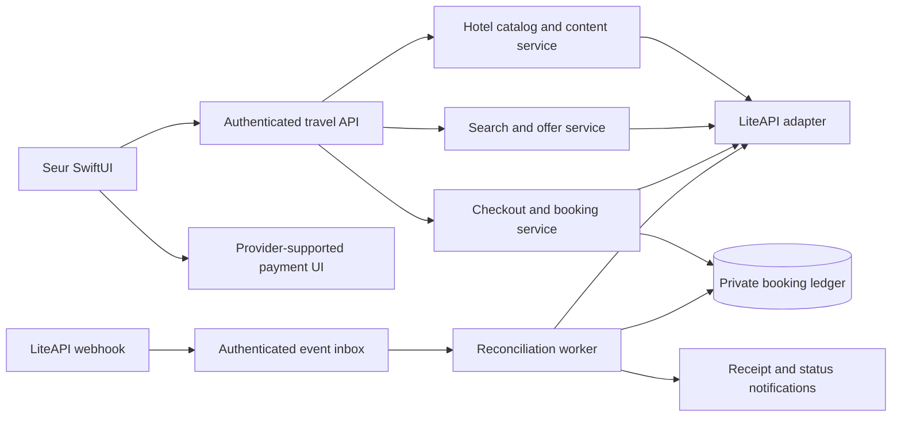

# Seur × LiteAPI integration design

Design date: September 10, 2026. Status: proposed implementation specification. No integration code, database migrations, deployment, payment configuration or booking has been created by this design.

## 1. Product decisions

Use Nuitée Connect (LiteAPI) as the only new hotel and flight booking supplier. Deliver hotel content first, hotel reservations second, and flights after their separate capability checks. The existing FlightAware integration continues to track flights.

Show one listing per hotel. For selected dates and guests, show the lowest eligible customer price among offers returned for that hotel. Within the hotel, preserve meaningful choices: room type, breakfast, cancellation terms and payment timing. Do not imply a worldwide lowest-price guarantee or hide an upgrade because a different room is cheaper.

Keep Seur's SwiftUI experience, ivory canvas, bronze accents, editorial typography and existing navigation. Provider identifiers, margin settings and API terminology belong in backend records, not shopping screens. Required supplier attribution, payment merchant and customer-support information remain visible where applicable.

Keep a provider boundary in the backend so another supplier can be added later. Build one adapter now; do not build cross-supplier comparison, automated supplier switching, package holidays, points redemptions or a combined flight-and-hotel charge in the initial release.

## 2. Evidence and open capabilities

The saved sandbox key passed nine read-only content requests in this task. Observations are a small sample, not a commercial inventory audit:

| Property | LiteAPI ID | Property photo URLs | Returned review records | Records containing a headline or comments | Room types with photos |
| --- | --- | ---: | ---: | ---: | ---: |
| The Savoy, London | lp2a32f | 91 | 500 sampled | 289 | 21 |
| The Peninsula Paris | lp7246c | 104 | 119 | 119 | 13 |
| Mandarin Oriental, Bangkok | lp1aae8 | 112 | 246 | 245 | 31 |

Image URLs were counted, not visually inspected. Room images may duplicate property-gallery images. Ratings-only records must not be represented as readable reviews. No live-rate, payment, cancellation, ticketing or servicing flow has been validated.

The reviews endpoint supports offset pagination and a maximum requested limit of 5,000; supplying the AI translation language parameter reduces the maximum to ten. Use original reviews for the initial release and page them in the UI. [Review reference](https://docs.liteapi.travel/reference/get_data-reviews).

Hotel details include galleries and room data. Rate-to-room matching is possible where the provider returns a mapped room ID; unmatched rates retain their supplier room description without borrowing a different room's photographs. [Hotel content](https://docs.liteapi.travel/docs/displaying-hotel-details), [room mapping](https://docs.liteapi.travel/docs/room-details).

## 3. Hotel screens

Section 17 defines the Home and Search redesign: worldwide provider inventory, typed hotel suggestions, filters and navigation. It replaces the CSV-limited discovery experience while preserving Seur's optional dining enrichment.

### Search and results

Entry points: Discover, Search, a trip's Add hotel action, and an existing saved hotel. Reuse the local destination directory and Apple Maps selection; pass country/city or coordinates to the hotel service.

The search form collects destination, check-in, check-out, room occupancy and currency. Exact calendar dates are required for rates. Start with one room, one to four adults, and up to two children with ages at check-in, subject to the selected offer's capacity. The model represents an array of room occupancies so additional rooms can follow without a schema replacement. Multi-room checkout is excluded from the first release until partial confirmation and cancellation are tested.

Collect the guest nationality required for rate eligibility explicitly. Do not infer it from device language, IP, residence or payment country. Keep nationality and point of sale separate. Changing dates, occupancy, nationality or currency invalidates the current rate selection.

Before dates are chosen, show hotel discovery without a live price. After Search, display one hotel card with photo, name, location, star category, guest rating and its source, total-stay price, secondary average nightly price, and the selected rate's cancellation/meal label. The total is primary. Include room count and nights so the nightly average cannot be mistaken for the full bill.

Default sort: Seur's relevant hotels, with the cheapest eligible offer on each card. Offer Price, Guest rating and Distance sorts. Price sorts only the hotels actually checked; progressive results display their loaded scope rather than claiming the entire destination was exhaustively compared.

Filters: total budget, star category, minimum guest score, free cancellation, breakfast, and supported amenities. Unknown attributes do not satisfy a positive filter. A provider timeout displays “Prices temporarily unavailable”; a successful empty search displays “No rooms available for these dates.” Do not conflate those states.

### Hotel detail

Order: photo gallery → name/location → guest score and rating count → date/guest selector → room availability → overview and amenities → Seur dining collection → reviews → map and policies.

The gallery uses thumbnails, a full-screen pager and provider captions. Category chips such as Rooms, Pool and Dining appear only when metadata supports them. Load the hero and visible thumbnails first. Display “View all 104 photos” only after counting the actual deduplicated gallery, not room duplicates or resized versions.

Reviews show a source-specific aggregate score and count separately from written feedback. Fetch 20 provider records initially and another page on explicit scrolling. Filter empty written content for the written-review list while advancing the provider offset by fetched records, not displayed rows. Cap automatic scans for sparse pages at three; let the user load more. Do not claim a complete written-review total unless the provider supplies one. Preserve original text, dates, available traveler type, and attribution. Do not mix Seur journal ratings into supplier scores or silently translate/summarize reviews with AI.

The bottom action reads “Choose dates,” “Choose a room,” or “Continue” according to state. Keep “Save to trip as a plan” as a secondary action. A saved plan is never styled as a confirmed reservation.

### Room selection

Group by confidently mapped room identity. Show the lowest comparable offer first within each room group, then distinct refundable/breakfast/payment packages. Unmapped room names remain separate unless exact identity can be established.

Each room card contains the supplier's room name, verified room photos, beds, capacity, size where known, meals, cancellation deadline, total price and fees payable at the property. Missing bed/view details remain unspecified; special requests are not guarantees.

### Checkout

Sequence: sign in → guest/contact form → recheck selected offer → review final terms → payment → confirmation. Preserve form entries across sign-in and validation errors. Require a verified contact email and usable phone number; older username-only accounts must supply booking contact information.

Collect guest names and required details before creating a payment session. Show full stay, room, occupants, currency, pay-now amount, pay-at-property amount, cancellation penalties, special check-in instructions and merchant/support information. Separate optional requests from guaranteed benefits. No optional paid extras are preselected.

Any change in room, meals, cancellation terms, payment timing or price requires renewed review; never substitute a room automatically. Final button: “Pay [amount] & book” for the initial prepaid flow. A return from payment authentication enters “Confirming your booking,” not success.

### Confirmation and My bookings

Confirmation requires a provider-confirmed reservation. Show Seur booking ID, available hotel confirmation code, dates, guests, room/rate, paid and outstanding amounts, policies, receipt access and support. If the hotel code is pending, say so while preserving the confirmed supplier reservation reference.

My bookings sits within Travel, with Upcoming, Past and Cancelled filters and visible Pending items. Bookings exist independently of trips. Linking to a trip is optional and must not upload unrelated local trip content. Trip deletion or removing a booking's itinerary card never cancels the supplier reservation.

Cancellation starts with a refreshed booking and a server-produced preview of the applicable penalty and expected refund. Confirm the exact cancellation action. Recompute if the deadline passes or terms change before submission. “Cancellation requested,” “Cancelled,” and “Refund pending/completed” are distinct. Changes to dates or rooms initially use a support request; do not silently cancel and rebook.

### Layout and accessibility

Use existing card surfaces, glass navigation controls and native sheets. Financial totals and payment forms use solid high-contrast backgrounds. Minimum 44-point targets, Dynamic Type, VoiceOver descriptions, reduced-motion behavior, image loading placeholders and inline errors are required. Never make color the sole distinction between test, pending and confirmed states. Sandbox builds display “Test booking” throughout checkout and confirmation.

## 4. Choosing the displayed rate

The backend, not the client, owns eligibility and comparison. Filter out expired offers, unsupported occupancy, incomplete essential terms, unavailable rooms and rates not permitted for the current sales channel.

The comparison key includes canonical hotel, room identity, beds/view when specified, occupancy, meal plan, cancellation schedule, payment timing, currency, and applicable eligibility restrictions. Differences in those fields create distinct choices. For equivalent offers, sort by full customer cost, then deterministic offer ID. Commission is not a ranking tiebreaker.

Compare the customer selling price after the configured margin and mandatory fees. Preserve original-currency property charges; only compare a converted total when the conversion basis is known and label it approximate. If a mandatory amount is unknown, flag the incomplete total and exclude the offer from an unqualified “lowest total” claim.

LiteAPI distinguishes included charges from those due at the hotel and supplies room, meal and policy fields. Public selling-price restrictions also apply. Treat Seur as a public channel until a contract explicitly permits another arrangement; installing the app or signing in does not automatically authorize special rates. [Rate structure](https://docs.liteapi.travel/docs/hotel-rates-api-json-data-structure), [pricing policy](https://docs.liteapi.travel/docs/revenue-management-and-commission).

Launch pricing uses a single explicit server-side margin policy with no personalized markup and no extra Seur checkout fee. The margin value is a business configuration decision to approve before commercial launch, not an invented percentage in code. Store its version with each quote. Never change only the displayed number: request and prebook the matching customer amount through the provider.

## 5. Backend architecture

Extend the existing Supabase `travel-api` service and opaque session checks. iOS never receives the LiteAPI API key or Supabase service key. Provider endpoints and credentials are selected by server configuration; users cannot submit arbitrary upstream URLs, payment amounts, owner IDs or environment switches.

Create a dedicated adapter rather than using the existing generic `upstream` helper unchanged. It must interpret provider error bodies even on HTTP 200, bound timeouts, sanitize errors, and distinguish safe reads from ambiguous booking writes. Search/content failures must not trigger automatic paid-provider fallback.

A future supplier implements the same hotel/content/offer/booking capability interfaces. Every stored supplier identifier is paired with provider and environment. Bookings stay with their original supplier for their entire servicing lifecycle.

## 6. Proposed Seur API contract

All routes below are new design proposals under `/v1`. Dynamic provider access initially requires the existing Seur account session; offline catalog browsing remains available. Public discovery can be added only with its own abuse controls and content permissions.

| Route | Purpose and boundary |
| --- | --- |
| `GET /booking-capabilities` | Content/search/payment/booking/flight availability and test-mode flags; no secrets |
| `POST /hotel-searches` | Validated destination, dates, occupancies, nationality, currency and filters; returns search ID, cards, cursor and coverage status |
| `GET /hotel-searches/:id` | Owner-bound additional results; cursor cannot change original search context |
| `GET /hotels/:id` | Canonical hotel, source-tagged content and gallery metadata |
| `GET /hotels/:id/reviews` | Opaque cursor, source and bounded review page; no arbitrary provider query passthrough |
| `POST /hotels/:id/offers` | Room packages for a validated search context, represented by opaque Seur offer IDs |
| `POST /hotel-checkouts` | Selected offer ID, guest/contact data, optional trip link; idempotently creates local checkout and supplier prebook |
| `GET /hotel-checkouts/:id` | Safe state, quote version and owner-only payment-session information when supported |
| `POST /hotel-checkouts/:id/confirm` | Explicit acceptance of current quote/terms and intent to book; durable action, returns booking or pending operation |
| `GET /bookings` | Only the current user's booking records, never the supplier's account-wide list |
| `GET /bookings/:id` | Booking and financial states, documents and available actions |
| `POST /bookings/:id/cancellation-preview` | Refresh terms and return a short-lived penalty/refund preview tied to booking version |
| `POST /bookings/:id/cancel` | Idempotent cancellation using the accepted preview; changed penalties require reconfirmation |
| `POST /bookings/:id/trip-link` | Links booking display to an owned trip; does not grant servicing rights to trip collaborators |
| `POST /webhooks/liteapi` | Provider-authenticated event reception; never accepts an ordinary client assertion of payment |

Every mutation uses a client idempotency key, actor and request hash. Same key and same request returns the same result; a conflicting request returns 409. Return stable error codes, a safe message, recovery action and operation ID. Use 202 for pending durable operations. New headers must be included in CORS where needed.

Hotel adapter upstream routes: content/search on `api.liteapi.travel/v3.0/data/hotels`, `/data/hotel`, `/data/reviews`; rates on `api.liteapi.travel/v3.0/hotels/rates`; prebook and book on `book.liteapi.travel/v3.0/rates/prebook` and `/rates/book`; recovery/list and retrieval on `/v3.0/bookings`, `/bookings/{bookingId}`; cancellation via PUT to `/bookings/{bookingId}`. Keep opaque IDs unchanged. [Endpoint overview](https://docs.liteapi.travel/reference/api-endpoints-overview), [booking lookup](https://docs.liteapi.travel/reference/listbookings), [cancellation endpoint](https://docs.liteapi.travel/reference/put_bookings-bookingid).

## 7. Records and ownership

Proposed tables, not migrations:

| Record | Essential fields / constraints |
| --- | --- |
| `travel_hotels` | Canonical UUID, optional unique existing catalog ID, name/location; preserves saved collection identity |
| `travel_hotel_sources` | Hotel UUID, provider, environment, provider hotel ID, mapping evidence/status; unique supplier identity |
| `travel_hotel_content` | Source, locale, version, fetched/expiry timestamps, content/rights metadata; no private guest data |
| `travel_hotel_searches` | Owner, environment, immutable search context/hash, coverage and expiry |
| `travel_hotel_offers` | Search/owner, hotel/source, encrypted opaque supplier offer, normalized room/price/policies, expiry and pricing-policy version |
| `travel_checkouts` | Owner, product, environment, offer, quote hash/version, prebook/transaction pair, encrypted required guests, independent booking/payment states |
| `travel_bookings` | Owner link, product/source/environment, unique client reference and supplier booking ID, immutable purchased terms, current status, optional trip link |
| `travel_booking_operations` | Idempotency key/request hash, operation state, lease and next retry; uniqueness by owner/action/key |
| `travel_booking_events` | Source event ID or deterministic digest, received/processed timestamps, restricted bounded payload; deduplication |
| `travel_booking_jobs` | Due time, attempts, lease, operation ID; durable reconciliation and notification outbox |
| `travel_booking_financials` | Authorized/captured/refunded amounts and currencies, commission expected/settled, fees and provenance |

Use exact decimal money representation and ISO currency codes; no floating-point monetary arithmetic. Store hotel dates as date-only values, cancellation instants with explicit time zone, and original supplier policy text alongside normalized terms. Missing or contradictory time zones block automatic penalty promises.

New exposed-schema tables follow the existing server-only model: RLS with no direct client grants; ownership checked using the server-derived actor before every read or mutation. Service-only transactional functions have narrowly scoped execute grants. A provider ID, trip share link or email address is never an authorization credential.

Bookings must not cascade away when a user deletes a trip or account. Before launch, change the current account-deletion flow to revoke access, delete ordinary personal content, and detach/pseudonymize only the minimum operational records required for unresolved reservations, refunds and applicable retention. Establish a documented retention schedule and post-deletion support path before enabling purchases. Account deletion does not cancel travel. Retained contact details need a stated purpose and deletion date; do not retain them indefinitely.

## 8. Content identity and caching

Map the existing catalog using name, address and coordinates, with manual review for ambiguous properties. “Savoy” matching an apartment is insufficient. Persist reviewed mappings; do not run name matching on every page opening. Provider-only hotels receive canonical IDs and no invented Seur dining content.

Separate licensed supplier content from Seur editorial content and user journals. Provider photos/reviews are not copied into private journal Storage, public recaps, templates or exports by default. Preserve attribution and rights per source; a future supplier comparison must honor those licenses.

Initial caching policy is conservative: in-memory view content and bounded in-flight request coalescing until the provider confirms persistent cache and image reuse rights. After confirmation, proposed maxima are 24 hours for hotel metadata, one hour for review pages, and provider-permitted image cache lifetimes. These are Seur proposals, not established LiteAPI permissions. Purge by source/version and honor upstream cache directives; avoid mass photo downloads.

Offers are short-lived server records for the originating search, never an offline promise. Use provider expiry where available; otherwise impose a conservative two-minute selection window followed by revalidation. This local window does not guarantee supplier validity.

## 9. Payment design and unresolved contract

Preferred launch model: LiteAPI's supported customer-payment flow, with the provider acting as merchant of record under the applicable agreement. Avoid making Seur responsible for collecting the entire room price and funding reservations through an agency card or wallet as the default architecture.

Target native iOS payment collection with a provider-approved SDK integration and 3DS return flow. Apple Pay is enabled only after its exact account, merchant and SDK requirements are confirmed. LiteAPI's direct integration guide uses web Stripe Elements and requires provider-issued publishable keys. Its mention of native use cases does not prove Swift PaymentSheet compatibility. [Payment guide](https://docs.liteapi.travel/docs/direct-stripe-integration-stripe-elements).

If fully native payment is unsupported, retain the same native shopping design and present a provider-approved secure payment page only as an explicitly reviewed product fallback. Do not silently substitute a webview and call checkout fully native.

The API reference describes `TRANSACTION`, while the direct Stripe guide uses `TRANSACTION_ID`. Resolve the payment enum and exact response shape against the chosen account flow before implementing checkout. Do not guess. Client payment secrets are returned only to their authenticated checkout owner with no-store responses; never log them or put them in URLs. Raw cards/CVCs never pass through Seur's database, API or analytics.

Persist the prebook and transaction relationship immediately. Guest/contact and quote acceptance must be durable before payment, so the server can complete an authorized purchase if the app closes. A worker may complete only a recorded user-approved booking whose amount and terms still match; it cannot create a substitute offer or charge a new amount.

Concrete handshake: create checkout and receive the reviewed quote; call the confirmation route to record acceptance and purchase intent before presenting the payment SDK; return a payment action while payment is still required. After the SDK returns, repeating that same confirmation request wakes reconciliation rather than trusting a client-supplied success flag. The worker submits the supplier booking only after authoritative payment evidence and a matching accepted quote. Payment evidence retrieval is a launch dependency to resolve with LiteAPI; a client callback alone cannot satisfy it.

## 10. Booking and payment state machines

Booking state: `draft → repricing → awaiting_acceptance → awaiting_payment → submitting → pending_confirmation → confirmed`. Terminal alternatives: `expired`, `failed`, `cancelled`. Ambiguous outcomes enter `reconciling` or `needs_support`, not failed-by-assumption. Cancellation adds `cancellation_pending`; that state cannot overwrite a later confirmed cancellation.

Payment state is independent: `not_started`, `requires_action`, `processing`, `authorized`, `captured`, `void_pending`, `voided`, `refund_pending`, `partially_refunded`, `refunded`, `failed`, `unknown`.

The payment UI reports progress, not authority. Provider retrieval/reconciliation establishes final status. No successful-payment screen is sufficient to mark a room booked. Conversely, a canceled booking does not prove a refund has reached the traveler.

Use one stable `clientReference` per purchase attempt. The supplier can reject a duplicate with code 4005; retrieve the existing booking by that reference. Never generate a new reference merely to get past a timeout or duplicate response. [Booking reference behavior](https://docs.liteapi.travel/reference/post_rates-book).

Transactions claim work and persist intent before external calls. No database transaction can atomically include the supplier; recovery must handle a supplier success followed by a database write failure. Worker leases and unique constraints prevent concurrent submissions. Interrupted requests leave durable work that another worker can reconcile.

## 11. Webhooks, recovery and support

Register separate sandbox/production webhook endpoints with strong authentication tokens. LiteAPI documents an `authorization` header shared secret, not a verified HMAC signing scheme; implement the documented mechanism and confirm any stronger option with the provider. Acknowledge only after durable inbox persistence, then process asynchronously. [Webhook configuration](https://docs.liteapi.travel/docs/using-liteapi-webhooks).

Validate environment, known booking identity, body size and event type. Deduplicate provider event IDs when available, otherwise a canonical event digest. A webhook triggers provider retrieval; do not allow an old event to reverse a newer state. Keep tokens and guest/payment payloads out of request logs. Unknown events are quarantined for inspection.

Use a scheduled worker with database leases and bounded retries, not a promise running after an Edge Function returns. Foreground polling can be 2, 5 and 10 seconds, then slower; background reconciliation initially uses 5 seconds, 15 seconds, 60 seconds and five-minute intervals. Stop automated submissions while an outcome is uncertain. Escalate unresolved paid/authorized attempts after ten minutes while continuing safe read reconciliation. These are proposed operational targets to tune during sandbox testing.

| Failure | Designed response |
| --- | --- |
| Content or rate lookup unavailable | Keep hotel page usable; show unavailable prices and an explicit retry |
| HTTP 200 containing provider no-availability error | Treat as empty inventory, not a valid quote |
| Expired or changed offer | Reprice and obtain renewed acceptance before payment |
| Prebook timeout | Recover known prebook where possible; do not create multiple payment sessions blindly |
| User closes app during payment | Reopen owner-bound checkout; reconcile server-side before offering payment again |
| Book timeout after payment | Look up stable client reference; show pending, prohibit a second purchase |
| Definitive booking failure after authorization/capture | Arrange provider-supported void/refund, report its actual state and create support work |
| Cancellation crosses penalty deadline | Require acceptance of refreshed penalty; no automatic higher-fee cancellation |
| Delayed/duplicate/out-of-order webhook | Idempotent processing and authoritative retrieval |

LiteAPI documents distinct incomplete-payment/booking and duplicate-reference errors. Match stable provider codes rather than HTTP status alone; present Seur-written recovery messages, not raw upstream text. [Error reference](https://docs.liteapi.travel/reference/api-errors-for-hotel-booking-workflow).

Support operations need a restricted view of pending paid bookings, failed cancellations, refunds, missing hotel confirmations and schedule changes. Staff see masked contacts by default and only the information needed to service a reservation. Establish who answers the traveler and who escalates to LiteAPI, including after-hours coverage. Receipt and notification jobs are deduplicated and contain no payment secrets.

## 12. LiteAPI flights phase

Use the same supplier abstraction and booking ledger with separate flight-specific schemas. Start with one-way and round-trip, a single ticketed itinerary, and provider-supported passenger combinations. Exclude self-transfers, split-ticket combinations and dynamic packages until their separate failure and servicing behavior is designed.

Flight screens: route/dates/passengers/cabin → itinerary results → fare-family comparison → passenger details → verification/prebook → available seats and bags → final amount/payment → pending ticketing → ticket confirmation. Display segment-specific cabin, operating carrier, connections, baggage and change/refund terms. A reservation code alone does not establish ticket issuance.

Search and verify before prebook. Flight prebook may create an actual supplier reservation; perform it only after the traveler intentionally proceeds, never while browsing results. Preserve exact offer IDs. Adding seats/bags can replace the payment transaction and client secret, so supersede the old pair atomically before payment. [Flight flow](https://docs.liteapi.travel/docs/build-a-flight-booking-experience), [extras](https://docs.liteapi.travel/reference/post_flights-prebooks-prebookid-services).

Proposed Seur routes: `POST /flight-searches`, `GET /flight-searches/:id`, `POST /flight-offers/:id/verify`, `POST /flight-checkouts`, `POST /flight-checkouts/:id/services`, `POST /flight-checkouts/:id/confirm`, with shared owner-scoped booking retrieval. Capability-specific cancellation previews and change requests map only to verified supplier operations; no invented upstream endpoint is assumed.

Represent passengers, itineraries, segments, fare families, services and ticket documents separately from hotel rooms. Store travel document information only when required and encrypted with restricted retention. Booking-time contacts do not imply reusable passenger profiles without the traveler's choice.

Retain FlightAware tracking after ticket confirmation. Cabin photography and exact suite identification remain capability-gated; LiteAPI hotel imagery cannot establish flight cabin coverage. If the exact product is unknown, show expected aircraft/cabin with uncertainty instead of promising a particular suite. No additional cabin-content contract is part of this LiteAPI-only design.

Flight production access needs separate approval. Sandbox flight data is unsuitable for validating real fares or route coverage; use provider test scenarios for workflow validation and an approved read-only production comparison later. [Flight access](https://docs.liteapi.travel/docs/getting-access-to-flights).

## 13. Cost and request controls

The published hotel core/content endpoints are included subject to fair use; paid places and price-index endpoints are excluded from the initial flow. LiteAPI's published flight fees are separate from hotels and include ticketing and servicing charges. None of these costs have been activated here. [API pricing](https://docs.liteapi.travel/reference/api-pricing-usage-costs).

Search only after a deliberate submission or filter application. Start with 20 hotel candidates and bounded pagination, not the whole catalog. Request review pages only on detail/review interaction. Share equivalent in-flight requests; cancel obsolete UI work without assuming cancellation prevents an upstream charge.

Proposed initial per-account limits: hotel search 10/minute, content 30/minute, reviews 20/minute, prebook 5/minute. Use a shared sandbox limiter below the documented five requests/second, with headroom for support and tests. Reserve provider capacity for retrieval, cancellation and reconciliation so browsing cannot starve existing bookings. Production caps must match the actual contract rather than advertised maximum throughput.

Track requests per endpoint, successful bookings, search-to-book ratio, conversion, coverage, response time, price changes, unresolved payments, refunds and realized commission after fees. Cost alerts and a search kill switch prevent unbounded spend. Disabling new bookings never disables servicing or reconciliation.

## 14. Repository integration map

| Existing location | Planned change |
| --- | --- |
| `iOS/Aurum/HotelDetailView.swift` | Enriched content, galleries/reviews, rate selection; retain separate planning action |
| `iOS/Aurum/DiscoverView.swift` | Date-aware single hotel cards and search states |
| `iOS/Aurum/Models.swift` | Preserve bundled Hotel schema; add separate normalized provider models rather than requiring new fields in old JSON |
| `iOS/Aurum/Travel/TravelServices.swift` | Authenticated typed booking calls, session-safe responses and test-network guards |
| `iOS/Aurum/Travel/JourneyModels.swift` | Optional booking link/source/status snapshot; legacy manual reservations remain decodable |
| `iOS/Aurum/Travel/JourneyExporter.swift` and sharing sanitizers | Explicit booking redaction; no guests, payment tokens, supplier payloads or privileged servicing links in public output |
| Proposed `iOS/Aurum/Booking/` | Search, room, review, checkout, booking detail and payment coordinator components |
| `supabase/functions/travel-api/index.ts` | Thin route dispatch to dedicated booking modules |
| Proposed backend `liteapi`, `hotel-content`, `hotel-search`, `booking-checkout`, `booking-worker` modules | Supplier adapter, normalized data, durable state and recovery |
| `supabase/functions/travel-api/account-deletion.ts` | Explicit reservation/retention handling before any live purchases |
| Future migrations and tests | Ledger, jobs, least-privilege functions and meaningful failure tests; no migration files are created by this design |

Keep the native app's current account/session system; do not accidentally use direct-client Supabase JWT assumptions for the new tables. Keep new booking flags off by default. The existing flight roadmap's Duffel candidate is superseded for this proposed phase by LiteAPI; its cabin-quality requirements still apply.

## 15. Implementation sequence and acceptance

| Stage | Deliverable | Acceptance gate |
| --- | --- | --- |
| 0. Provider contract | Resolve payment flow, rights, public-rate eligibility, margin and servicing | Written answers and sandbox payment access; no unsupported capability presented as available |
| 1. Hotel enrichment | Reviewed mappings, photos, room metadata and paginated reviews | 30–50 varied hotels checked; incorrect mappings rejected; sparse/empty data handled honestly |
| 2. Hotel rates | Search, occupancy, total-price logic and room packages | Known cases prove fee accounting, room distinctions, eligibility and quote expiry |
| 3. Sandbox checkout | Guest collection, payment challenge, confirmation and recovery | Test-only flow survives app termination, duplicate taps, timeouts and supplier/database disagreement |
| 4. Servicing | My bookings, cancellation preview, refund tracking, receipts and support | Policy-boundary tests, owner isolation and durable reconciliation pass |
| 5. Limited hotel launch | Approved production configuration for a controlled audience | Native payment decision resolved, live support available and all purchase gates satisfied |
| 6. Flights | LiteAPI flight workflow using the shared foundation | Separate airline/payment/ticketing/servicing coverage proven before enabling production |

Automated tests use fixtures and mocked networking. Sandbox smoke runs are separate and explicitly opt-in; never create real bookings in routine CI. When implementation is authorized, execute the existing iOS build and backend regression suite as well as new booking tests.

Required scenarios: owner A cannot read/cancel B's booking; same idempotency key returns one operation; supplier accepted but DB write failed; payment finished but app terminated; expired offer/changed meal or cancellation terms; rating-only reviews; pagination with empty text; duplicate photo variants; ambiguous hotel mapping; tax-included versus property-payable fees; date-line/DST policy deadlines; zero and partial penalties; missing time zone; changed cancellation quote; out-of-order events; sandbox/live mix rejected; account/trip deletion cannot erase unresolved financial work or cancel travel; test runs cannot use live credentials.

Cancellation normalization retains meaningful zero-penalty periods and the complete ordered schedule. A refundable label alone does not establish the refund amount; a nonrefundable label does not necessarily mean every component is nonrefundable. If provider terms contradict each other, route the decision to support rather than inventing a penalty.

## 16. Questions for LiteAPI before checkout implementation

These are provider dependencies, not questions the user must answer now. No message has been sent.

1. Can this account use a fully native Swift/iOS payment SDK with LiteAPI-created payment sessions? Which SDK/version, publishable keys, merchant configuration, Apple Pay and 3DS return mechanism are supported?
2. For that flow, which payment method enum is correct, how are authoritative payment states retrieved, and how are voids/refunds reconciled without access to LiteAPI's Stripe webhooks?
3. What are the permitted photo/review display, attribution, persistent caching, retention and cross-supplier use rights for this consumer app?
4. What public-rate and member-rate rules apply, how is SSP enforced in search/prebook, and what margin/payment/commission costs apply to this account?
5. What recovery guarantees cover timeouts, duplicate client references, payment-authorized-but-unbooked attempts and cancellation uncertainty?
6. Who provides first-line and after-hours support, hotel confirmation follow-up, relocation, refunds and flight schedule-change servicing?
7. Which flight airlines, markets, cabin details, seat maps, ticket documents and post-booking actions will this account actually support?

The local sandbox secret remains in the ignored `.env.liteapi.local`. During implementation, place credentials only in the chosen backend environment's secret store, with independently gated sandbox and production access. This document does not authorize activating production charges or deploying the proposed integration.

## 17. Home and Search redesign for broader hotel inventory

### Direction

Seur should open like a contemporary travel publication and search like a fast booking product. Photography leads discovery; dates, room details, guest feedback and complete prices lead purchase decisions. Hotels outside the original CSV are first-class results. The old dataset becomes an optional editorial enrichment, never the boundary of discovery.

LiteAPI access is verified for three sample properties, not every hotel. The design supports its broader available inventory without promising universal property coverage, photos, reviews or bookable rooms. Any future mockup prices must be labeled illustrative. Production uses licensed provider photography and actual dated offers; the three previously tested hotels are examples, not a search restriction.

### What changes

| Current experience | New design |
| --- | --- |
| Search opens as a generic large sheet with Done | Full-screen native search destination, with Back and preserved state |
| Mixed placeholder: city, hotel, restaurant, cuisine | “Where would you like to stay?” with typed destination/hotel results |
| “The collection” and CSV record count | Destination/date context and a truthful result count or loaded-result scope |
| Small hotel thumbnails and dining-first metadata | Large hotel photos, guest score, neighborhood and room/rate information |
| Dollar-symbol price bands | No price without dates; total-stay amount and secondary nightly average after rates load |
| Fixed city and cuisine pickers | Worldwide destination selection and stay-specific filters |
| Compare dining repeated on every result | Save on the card; room choice in detail; dining comparison within editorial content |
| The same three featured properties | Server-curated, geographically varied selections from available provider content |

### Home information hierarchy

Keep the existing five tabs: Discover, Map, Travel, Friends and Concierge. Treat Discover as Home without renaming unrelated navigation in this work. The search control becomes the principal action; a separate sixth tab is unnecessary.

1. **Quiet brand header.** Seur wordmark and profile control. Avoid duplicating the main search action with a competing toolbar magnifier.
2. **Search introduction.** Editorial title “Somewhere worth staying.” Prominent destination/hotel search surface, followed by dates and guests. Searching is possible without dates for discovery; booking prices require them. Show a compact recent-search shortcut only when one exists.
3. **Current trip, when relevant.** Preserve the useful live-trip context. While traveling, show a compact Today row above discovery; expand it only by tapping. Do not let a three-item itinerary card push hotel search below the first screen. Otherwise, show Continue planning after the first discovery section.
4. **A small editorial selection.** One large hero and two smaller supporting cards. Each includes actual hotel photography, location, name and one evidence-backed reason to inspect it. Images remain linked to the actual property. Eligible dated rates may appear only when the user's dates, occupancy, currency and nationality apply.
5. **Explore by destination or stay preference.** Select from destinations with usable provider content. Theme chips such as Pool, Spa and Beachfront map to verified structured attributes. Do not manufacture “design hotel,” “best,” “trending,” or “romantic” tags from image appearance or star rating.
6. **Continue exploring.** Recently viewed and saved hotels, deduplicated against other sections. Hide absent personal sections rather than inventing history. Travel guides, dining, activities and Concierge remain accessible as quieter secondary entries.

Home is finite: at most three hotel sections, four destination entries and twelve hotel candidates per refresh. No endless feed, mass rate polling or fabricated popularity. Rotate content only on a new session or deliberate refresh, not beneath a user's finger. Preserve scroll and save state on return from details.

### Search has three distinct states

#### A. Search entry

Full-screen page with Back, a clearly focused search field, recent searches and suggested destinations. Typing produces separate Destinations and Hotels groups with address/country context. Hotel name lookup has destination context where possible; ambiguous names require a listing choice.

Reuse the local directory and Apple destination suggestions. Resolve provider hotel candidates through the backend; do not expose paid Places endpoints on every keystroke. Debounce provider hotel-name discovery, suppress identical in-flight requests and cap suggestion rows. Empty input shows useful discovery, not all 1,513 CSV records.

Dates open a native calendar with check-in/check-out and an explicit Browse without dates choice. Guests open a room occupancy sheet with child ages where applicable. The visible action is “Explore stays” without dates and “Search stays” with dates. Changing destination clears incompatible hotel/rate selections; editing a field does not silently start a booking.

#### B. Browse without dates

Show destination heading, neighborhood, photo, star category and source-specific guest score/count. Primary action: “View hotel.” Secondary line: “Choose dates for prices.” Do not show stale sample prices or zero as a placeholder. Filters cover content attributes only; breakfast and free cancellation become available when dates permit rate-level filtering.

#### C. Dated results

Collapse the form into an editable search summary: destination, dates, nights, guests. Below it, show Filters with active count, Sort, and List/Map controls. Selected filters appear as removable chips; changing them is explicit and preserves context.

Each hotel appears once. Card hierarchy:

- 16:10 photograph, save control and gallery action. Photo count is based on the available deduplicated gallery.
- Name in a restrained serif, then neighborhood and hotel category.
- Guest score and labeled aggregate rating count, with source attribution. Never call ratings-only records written reviews.
- One selected room/rate line: room name, meals, cancellation deadline or “Nonrefundable.”
- Total for the entire stay, with average/night secondary. Include the pay-now/pay-at-property split where needed.
- Clear “View rooms” action. No airline-style urgency, unsupported scarcity or crossed-out fictional rates.

The lowest eligible total for the hotel is the default; distinct room and policy choices remain on the detail page. Customer price determines the selected equivalent offer, not Seur's commission. Unknown mandatory fees prevent an unqualified lowest-total claim.

No exact “X stays” until the count is known. If only a subset has been priced, say “Showing X stays” with load-more status. A partially loaded destination sorted by price does not claim an exhaustive citywide minimum.

### Filters and map

Use a purpose-built sheet with a clear title, Reset, grouped controls and an Apply button. Stage changes locally until Apply. Do not use the current generic Form with a long fixed city Picker.

Filter groups: total budget in the selected currency; refundable rates; breakfast included; hotel category; minimum guest rating; amenities such as pool, spa and parking; neighborhoods; room/bed attributes when reliably mapped. Keep hotel star category separate from guest score. Exclude unknown metadata from positive filters. Do not present inaccessible or ambiguous room features as guaranteed accessibility.

Sort choices: Recommended, Total price, Guest rating, Distance from chosen point. Define Recommended transparently using destination relevance, editorial relevance when available, content completeness and supported preferences. No invented quality score and no commission-based ranking. Guest score sorting should show rating counts and avoid implying a single five-star review is stronger evidence than hundreds of reviews.

The map uses native MapKit with canonical property coordinates and price pins only for valid dated offers. Selecting a pin shows the same card and offer as the list. Panning does not automatically launch more provider searches: “Search this area” starts a bounded query. Preserve filters and selection when toggling List/Map. The map implementation must use actual geographic coordinates and MapKit geometry.

### Visual language

Use the existing warm ivory/charcoal adaptive canvas and bronze accent, with serif display headings and system sans-serif for rates and forms. Product content sits on one opaque surface; reserve Liquid Glass for navigation and small floating controls. Keep photos clean and avoid large opaque badges over architecture.

Reference mobile geometry: 20-point page gutters, 24–32-point section separation, 16–20-point card corners and 44-point action targets. Header display text is approximately 34–38 points; hotel titles 22–25; body 15–17; metadata 12–14, all scaled for Dynamic Type. At accessibility sizes use stacked price/actions and shorter control rows. Essential names, totals and cancellation labels are never truncated to fit the normal layout.

Home can use a larger photographic treatment; search prioritizes scanning. Use roomier photographic cards on Home and a more compact treatment in Search; these are screen-specific layouts, not traveler settings.

### Data and backend changes to the integration plan

Add a bounded discovery service that returns canonical hotel IDs, approved editorial metadata, source attribution, image references and section reasons. Proposed `GET /v1/hotel-discovery` accepts locale and an optional explicitly selected destination; it does not accept private trip content. Personal recent/saved sections are composed locally or through existing owner-scoped records.

Add `POST /v1/hotel-suggestions` for a validated typed hotel query and destination context. Its results contain stable identities and addresses, not booking offers. Keep this distinct from `/hotel-searches`, which handles dated inventory and eligibility.

Destination searches query provider inventory, not a join restricted to CSV hotel IDs. New properties enter `travel_hotels` and `travel_hotel_sources` without requiring dining venues, editorial text or the legacy price band. A content-complete provider-only hotel can be ranked and booked exactly like a mapped collection hotel. Reviewed legacy matches keep saved identities and enrich detail pages.

`HotelCardViewModel` needs: canonical ID, display name, location, image state, attribution, category, guest score/count, favorite state, discovery context, and optional dated offer summary. It must not depend on `Hotel.venues`, `Hotel.price`, hardcoded `Hotel.image`, or `TravelStore.cities`. Use separate browse/loading/available/unavailable/error rate states instead of an optional numeric price alone.

Home content eligibility requires confirmed property identity, permitted imagery and enough factual metadata. Missing imagery is tolerated in deliberate search results with an honest placeholder, but excluded from promotional hero slots. No whole-catalog downloads or eager per-hotel review calls.

Existing global dining/restaurant discovery remains reachable through Dining and City Explorer. Removing cuisine from hotel Search does not remove restaurant search from Seur. Dining comparison remains a specialist action inside the collection/detail context.

### State and rollout behavior

Home/Search must preserve current-trip visibility, saved hotels, recent searches, scroll position, and return navigation. Search request IDs prevent late responses from a previous destination replacing current results. Backend environment/account changes clear private offers and quote state.

Keep distinct states for no matching hotels, no available rooms, provider outage, missing photos, zero ratings, offline catalog-only browsing and incomplete result pages. Offline fallback explicitly says “Saved collection · Offline”; it never masquerades as worldwide live inventory. Empty states offer editing filters or dates, not a misleading retry that repeats the same failure.

Roll out behind the hotel-discovery capability, then rates and checkout separately. Before activation, existing planning remains available. Do not make a new “Book” button route to an external hotel website without clear labeling. After activation, new supplier properties must be discoverable without modifying the bundled CSV.

### Acceptance criteria

1. A hotel and destination absent from the original CSV can appear in suggestions, search, detail and saved items.
2. Home is not keyed to the three hardcoded featured hotels and does not require a hotel's dining data.
3. Search without dates never displays booking prices; dated results retain dates/occupancy throughout navigation.
4. Hotel category, aggregate ratings and written reviews remain distinct and source-labeled.
5. A single hotel with multiple supplier rate packages appears once in results; meaningful choices survive in detail.
6. Price ranking includes supported mandatory costs and does not silently promote higher-commission offers.
7. Photo failures, missing metadata and provider outages have different usable UI states.
8. Existing trips, journals, restaurants, saves and account flows remain intact.
9. Dynamic Type, VoiceOver, dark mode, reduced motion and small-device layouts are verified during implementation.
10. Only deliberate searches/filter applies/map-area requests create inventory calls; scrolling Home does not start rate searches.

This section governs the Home/Search implementation when development is authorized. No interface changes are implemented by this document.

## 18. Discovery implementation — September 10, 2026

The user authorized implementation after the planning-only work. The first slice now connects native hotel discovery to the LiteAPI sandbox through the existing Supabase `travel-api` function. Production charges and booking remain disabled.

Implemented:

- Authenticated `GET /v1/hotels` with coordinate-based destination search, optional hotel name, minimum guest score, hotel-star filters, bounded 20-record pages and deduplicated hotel IDs.
- Authenticated `GET /v1/hotels/{liteapi:hotelID}` for descriptions, property photographs, facilities, room metadata and room photographs; `GET /v1/hotels/{liteapi:hotelID}/reviews` for paginated written reviews. Review cursors advance over source records, including ratings without text.
- Server-only `LITEAPI_SANDBOX_KEY`, explicit sandbox responses, `hotels` capability and `hotelBooking: false`. The shared database limiter caps hotel requests at two per second across instances and 30 per minute per account. Provider failures are sanitized. No schema or account-authentication changes were needed.
- Photography-led Home discovery with destination choices, up to six hotel cards from one bounded search, travel-guide and offline dining-collection links. Signed-out users retain the offline editorial hotel card and see a sign-in entry point for the broader collection.
- Full-screen hotel Search with worldwide destination autocomplete using the existing native destination system, hotel cards, save actions, list/map switch, load-more pagination, server filters, alphabetic ordering explicitly limited to loaded results, and loading/empty/error states. Search state survives visiting a hotel and closing/reopening Search.
- Native hotel details with property gallery, expandable amenities and room types, room galleries, separately requested guest reviews, neighbourhood map and Add to trip. Rates and availability are not implied.
- New hotel bookmarks reuse the existing wishlist archive with minimal provider identity and location fields. Provider photos, written reviews, descriptions and rating aggregates are not persisted in bookmarks or shared itineraries. Photo loading uses an ephemeral session. The three manually verified legacy mappings retain existing bookmark IDs and dining links; no fuzzy automatic joins were introduced.
- Dedicated offline hotel fixtures prevent XCTest and UI testing from issuing live hotel-provider calls.

Deliberate sequencing: the proposed dedicated discovery and suggestion backend routes are not needed for this slice. Home reuses the bounded hotel-search endpoint and destination suggestions reuse the existing native system. Date/occupancy input is now implemented as described in section 19. Full rate comparison, bookable room packages, checkout, booking management, flight booking, and adding other suppliers remain subsequent stages. Amenity filtering is deferred until its supplier facility-ID taxonomy is normalized; amenities are displayed on details now. Persistent provider-content caching and production rollout still depend on the rights and commercial questions in section 16.

Live sandbox acceptance checked 30 hotel details across Rome, Kyoto, Lisbon, London, Paris and Bangkok, plus one review page per city. Those hotels returned 39–185 property photographs and 7–41 room types. These are observed samples, not a guarantee for every property. The temporary validation account was deleted. Aggregate results are available locally in `work/hotel-sandbox-validation.json`; no key, review text or photo URL is stored in that report.

## 19. Minimal hotel flow and interaction standard — September 10, 2026

This section supersedes the earlier Home/Search layouts. Section 22 updates global discovery and replaces the original booking-sheet navigation with full-page navigation. The user rejected the large introductory heading, descriptive paragraphs, oversized separate search fields and noisy empty state. All new hotel and booking interfaces should follow this simpler visual and interaction standard.

**Visual system.** Use a white/adaptive system canvas, dark primary text and restrained neutral surfaces. The search control sits at the top and stays visible while results scroll. No marketing headline or introductory paragraph precedes it. Dates and adults/rooms live in compact chips. A result is one photograph, one hotel name, location/category and a compact guest score. Saving is a small control on the photograph. Keep supplier attribution and capability information concise; do not present developer terminology as product copy. Empty and failure states use a short sentence and one useful action, with the search controls still available.

**Search sequence.** Global Search opens destination discovery, not hotel criteria. A city guide provides an explicit **Find a hotel** action that carries its city into a full-page range calendar. Selecting check-out briefly acknowledges the range, then advances automatically to guests. Flexible dates follow the same route. Continue commits the complete draft and opens hotel results. Back revisits the previous step; leaving the setup page discards unapplied changes. Editing dates from results or hotel detail follows the same dates → guests sequence; editing guests starts on the guest page. No action reserves inventory until the separate explicit final confirmation.

**Calendar.** Use a full-page calendar with a clear check-in/check-out summary, local weekday order, readable month grids, connected range highlighting and unavailable past days. Advance after selecting check-out, with a 220 ms acknowledgement. At accessibility text sizes, guest counters stack vertically in a scrollable page and footer actions remain reachable. Calendar summaries and seven-column date numerals use bounded scaling, with full date labels available to VoiceOver. Icon controls retain 44-point tap targets in both appearances.

**Motion and haptics.** Use restrained 280 ms smooth transitions within setup, native navigation between pages and native photograph-to-detail zoom. Reduce Motion disables custom animation/scaling/zoom. Selection haptics acknowledge destination and input-step changes, date selection, counters, filters, map/list changes and bookmarks. Success feedback accompanies completed date ranges, applied guests and confirmed completion. Do not vibrate on passive loading, scrolling or text entry. Physical haptic sensation must be verified on an iPhone; Simulator cannot verify it.

**Hotel → room → stay plan.** Hotel details start with photography and a compact name/location/rating block. Overview, Rooms and Reviews shortcuts scroll within the page. Amenities and room information open focused sheets; show only a few room previews before an optional expansion. Photo galleries swipe horizontally and display each complete photograph without cropping. Plan stay, or Plan this room, carries the selected hotel and room preference into a compact review. Missing dates advance to guests, then to trip selection; completed search preferences are reused. Choosing a trip returns to review. Only Save to trip writes the planning record. Duplicate stays and persistence failures do not produce a success message. A planning record is never represented as a confirmed hotel booking.

**Complete booking design for the following integration stages.** Keep the same compact criteria bar and bottom action throughout the sequence:

1. **Results:** show eligible full stay totals once live rates are available, with property-payable amounts distinguished. A result opens the hotel; it does not reserve inventory.
2. **Rooms:** show a photograph, bed/occupancy summary and clearly differentiated room/meal/refund packages. Choosing a package automatically moves to guest details after successful repricing. Changed price or policy requires a concise review before proceeding.
3. **Guest details:** one focused form, saved traveler selection when available, inline validation and the keyboard's Continue action. Completing valid details advances to payment selection; keep a clear back path and retain entered data.
4. **Payment:** use the supported native payment sheet and required authentication challenge. Returning from payment setup advances to a concise final review. Never imply a payment or booking succeeded merely because a sheet closed.
5. **Review and book:** a compact hotel/date/room summary, total and payment breakdown, cancellation deadline and payment method. The final explicit **Pay & book** action is always required. Automatic progression must never submit a charge or reservation without that action. Disable repeated submission while the existing durable booking state machine resolves it.
6. **Confirmation:** only an authoritative successful booking reaches a receipt with hotel confirmation, dates, travelers, cancellation and itinerary actions. Pending/unknown outcomes use a calm progress/recovery screen instead of an invented success. Haptic success occurs only after confirmed completion.

The booking screens remain dependent on the rates/payment/servicing stages already described in this document. This redesign implements the actual discovery and planning interactions, not a fake checkout or an activated payment flow.

## 20. Sandbox hotel rates — September 10, 2026

Stage 2 is implemented. Dated Search now requests one bounded rates batch after guest details are applied. Flexible browsing and Home remain content-only. Hotel cards show one selected test offer; opening a hotel loads up to 40 room packages and maps photographs only by the provider's explicit room ID. Meal and cancellation differences remain separate options. Selecting an option advances to a server-validated quote review; it does not prebook inventory.

**Criteria and limits.** The guest sheet assigns adults and children to individual rooms and requires each child's age at check-in. Nationality is an explicit user choice, never inferred from locale or residence. Currency starts at USD and is editable. Supported search scope is 1–8 rooms, 1–8 adults and up to four children per room, at most 24 guests, and 1–30 nights. The server validates all fields, limits one request to 20 hotel IDs, uses an eight-second provider search window and an 18-second HTTP deadline, and accepts no client markup, supplier URL, environment or AI-search parameters. Rate calls share the existing two-per-second provider limit and have an additional ten-per-minute account budget.

**Routes and quote ownership.** Authenticated `POST /v1/hotel-rates` supplies `hotelIds`, date-only `checkin`/`checkout`, `occupancies`, `guestNationality`, `currency`, and optional `detail: true` for one hotel. The reply contains per-hotel available/unavailable/no-eligible-offers states, normalized offers, immutable criteria, sandbox status and local quote expiry. `POST /v1/hotel-quotes/inspect` validates an opaque quote and returns its normalized review. It makes no supplier call and is not repricing. The unchanged existing app-session middleware derives the actor; the gateway configuration remains exactly as previously deployed.

For this read-only stage, quotes are encrypted and authenticated with AES-GCM, bound to owner, sandbox environment, original criteria, provider offer identity, pricing-policy version and a five-minute local expiry. They stay in client memory, and provider offer IDs are not exposed in cleartext. This avoids creating a database ledger before checkout exists. The five-minute limit is a Seur freshness limit, not a supplier availability guarantee. Stage 3 must persist an owned checkout and perform provider prebook/repricing before payment; these stateless quotes do not replace that durable state machine.

**Price accounting.** Amounts are decimal strings over the app boundary and exact currency minor units on the server. Included taxes are not added twice. Full stay totals include all requested rooms plus known mandatory hotel-payable charges in the same currency. Original-currency foreign charges and unknown amounts/timing remain visible separately; such offers do not claim a complete total. Complete totals rank before incomplete totals. Cards choose the lowest complete total among the returned eligible candidates; sorting is explicitly scoped to checked stays, not the entire destination or all suppliers. Invalid room counts/child ages, inconsistent aggregate prices, package-only rates and packages with no common supported payment method are rejected. Cancellation deadlines require unambiguous timestamps; unknown or elapsed penalties never support a free-cancellation promise.

**Sandbox/public-price boundary.** Only responses explicitly marked `sandbox: true` can contain displayed rates. Test rates use the account's existing default pricing, with no new margin or checkout fee. Public selling-price floors are retained and evaluated separately. Below-floor rates may be inspected only as labelled sandbox test quotes; `publicPriceEligible: false` is not production eligibility. No closed-user-group rights are inferred. The live sample returned below-floor prices, so a commercial pricing policy and provider-supported matching repricing remain requirements for production checkout. A client cannot activate production by changing a request field. Both the server and review response keep checkout disabled.

**Native behavior.** Changing dates, guests, nationality or currency invalidates previous results immediately. Obsolete requests are cancelled and their late responses ignored. Explicit refresh is available; no rate polling runs in the background. Expired quotes stop showing as current options and are rejected by the server. A room quote displays every room, meal plan, cancellation schedule, subtotal, included fees, hotel-payable charges and complete total when available. The existing Plan stay remains a distinct action and stores no confirmed reservation or quoted price. Dynamic Type, reduced motion and haptics carry through the new screens.

**Acceptance.** Unit and handler coverage verifies exact fee accounting, zero-/three-decimal currencies, unknown fees, public floors, package restrictions, multi-room matching, production-response rejection, opaque token authentication/expiry, owner isolation and rate limits. A separate opt-in live script (`supabase/tests/hotel_rates_live.py --sandbox-rates`) performs five bounded sandbox scenarios with disposable accounts and no prebook/payment/booking calls. Its aggregate report is `work/hotel-rates-validation.json`; no credential, quote token or provider response body is retained there. The tested family inventory was package-only and correctly excluded; deterministic multi-room fixtures verify accepted standalone packages.

Current official references: [rates endpoint](https://docs.liteapi.travel/reference/post_hotels-rates), [rate response and fee definitions](https://docs.liteapi.travel/docs/hotel-rates-api-json-data-structure), and [public selling-price and account-margin rules](https://docs.liteapi.travel/docs/revenue-management-and-commission).

**Next: Stage 3 — sandbox checkout.** Add the durable owned checkout/operation records, provider prebook and price-change acceptance, guest/contact collection, supported payment UI, explicit final purchase intent, and authoritative confirmation/recovery. Booking, payment and flight integration are not enabled by this rates release.

## 21. Sandbox checkout implementation — September 10, 2026

**Implemented slice:** native guest collection → durable prebook → final quote review → explicit **Confirm test booking** → provider submission/recovery → verified receipt or a visible needs-attention state. This is the sandbox reservation part of Stage 3. It does not complete the real payment/3DS acceptance criterion. The server selects only `LITEAPI_SANDBOX_KEY` with a `sand_` prefix, prebooks with `usePaymentSdk: false`, and uses LiteAPI's documented no-charge `ACC_CREDIT_CARD` simulation. No card, wallet, credit line, Apple Pay or real payment collection is enabled.

**Native experience.** Checkout uses the shared minimal hotel surfaces, a compact progress indicator, automatic advance after guest submission/prebook, native transitions, Reduce Motion support and selection/success/error haptics. Price or term changes are visible before the final button. The final booking always requires a separate explicit action. A clock control beside Search dates/guests opens **Test bookings**, including saved reviews and pending attempts after an app restart. UI fixtures are isolated from provider traffic and labelled test-only.

**Routes.** `POST /v1/hotel-checkouts` accepts a client UUID, opaque owner-bound quote, lead guest names/email/international phone and a display-only hotel name. It currently supports one room, a complete same-currency total, and online-payment-eligible rates. The server still derives property, dates, occupancy, pricing policy and supplier identity from the encrypted quote. `GET /v1/hotel-checkouts` returns the latest 30 owned attempts; `GET /v1/hotel-checkouts/:id` resumes one; `POST /v1/hotel-checkouts/:id/confirm` requires the exact quote version and `acceptTestBooking: true`. Client payment-success flags have no authority. All replies retain `Cache-Control: no-store`. `hotelSandboxCheckout` reports this capability; `hotelBooking` remains false for real booking. Quote inspection enables test checkout only for eligible offers; the rate-search envelope remains a read-only quote envelope.

**Durability and ownership.** `travel_hotel_checkouts` stores the immutable search/pricing snapshot, quote version, prebook ID, stable client reference, acceptance time, independent `test_no_charge` payment presentation, operation state and lease. Guest/supplier-offer data is AES-GCM encrypted and authenticated to the checkout ID, using a domain-separated server-key derivation. A dedicated versioned key with rotation/migration remains a production requirement. A client request ID and owner/quote uniqueness make creation idempotent; reuse with different guest data is rejected. Reviews expire after five minutes locally. This does not promise provider inventory holds.

**Worker.** The minute cron job `seur-hotel-checkouts` issues a short-lived single-use ticket and claims one due attempt with `FOR UPDATE SKIP LOCKED`. It persists submission state before calling LiteAPI. Once submission begins, recovery performs only lookup by the same client reference and then full booking retrieval; it never resubmits `rates/book`, including after HTTP errors or duplicate-reference code 4005. Lease tokens fence late writes. A crash between claiming and sending may need support rather than an automatic retry. This deliberately conservative sandbox worker is not the final production throughput/retry policy. Ten unresolved checks stop in `needs_support`; a confirmed provider result with a mismatched product goes there immediately.

**Verification boundary.** Success requires matching reference, property, stay dates, currency, room subtotal, room identity, occupancy/child ages, meal plan, hotel fees and cancellation terms. A reference-list row alone cannot confirm anything. Full retrieval verifies the nested sandbox marker. The prebook normalizer accepts the observed scalar or object selling-price floor without altering amounts. Explicit package-only remarks override inconsistent standard-rate flags. Below-floor sandbox quotes remain test-only; no production margin/public-price policy is activated.

**Privacy and deletion.** Both new tables have RLS and no direct anon/authenticated grants. Privileged functions use `SECURITY INVOKER`, empty search paths and revoked public/client execution. The worker has separate tickets from flight notifications. Account deletion detaches minimal operational records; it is not a hotel cancellation. Only an already accepted attempt retains encrypted guests until submission/recovery; terminal processing clears them. Unsubmitted abandoned reviews are expired and scrubbed by maintenance. Production retention, servicing, webhooks, operational support and refunds remain gated.

**Live finding, not a passed happy path.** One real LiteAPI sandbox booking was submitted with synthetic contacts and no charge. Creation/confirmation retries returned the same attempt, cross-owner access failed, and stale-version acceptance failed. LiteAPI returned a confirmed booking whose occupancy, meal plan and cancellation terms disagreed with the accepted prebook. Seur did not display success. After reference/full-detail recovery it recorded `needs_support` and removed encrypted guest data. No replacement booking was made. The aggregate evidence is `work/hotel-checkout-validation.json`; provider questions and exact sandbox references are in [LiteAPISandboxQuestions.md](LiteAPISandboxQuestions.md), prepared but not sent.

**Remaining Stage 3 work.** Resolve the sandbox discrepancy and validate a provider-consistent end-to-end happy path, then obtain the provider-approved native iOS payment contract/publishable key, authoritative payment verification and 3DS/void/refund handling. The current OpenAPI schema and direct Stripe guide use `TRANSACTION_ID`; the older introductory prose still says `TRANSACTION`. No real payment path has been built from that ambiguous prose. Stage 4 servicing and production activation remain subsequent work.

## 22. Explore-first search and full-page hotel booking — September 10, 2026

This is the current navigation contract and supersedes earlier references to global hotel search and booking sheets.

- **Global entry:** Discover’s Where to? control and the magnifying-glass buttons open Explore. A pinned destination field, recent cities, photographic destination cards, regional city browsing, and Dining / Things to do / Guides shortcuts make the page useful before choosing any hotel or dates. Selecting a city opens its guide with places and discovery actions.
- **City entry:** the guide includes a single adaptive dark **Find a hotel** button with the city subtitle and arrow. It opens the hotel flow in the existing navigation stack. Returning from hotel results returns to that same city guide; returning again restores the Explore query. Opening a city map closes global Explore so the selected map is visible.
- **Explicit hotel entry:** the Home Stays shortcut opens destination → dates → guests. The hotel section’s See all carries its current destination. Global search never inherits the last hotel’s criteria or defaults to hotel results.
- **Page sequence:** city → dates → guests → hotel results → hotel detail → room quote → guest contact details → final test review → confirmation/pending/needs-attention. Criteria edits, nationality and child-age selection, filters and saved test bookings also use full-page navigation. The existing separate trip-planning, optional amenities/room-information and photo-gallery surfaces retain their own presentation behavior; they are not steps in checkout.
- **Drafts and state:** setup edits stay local until guest Continue. Back from guests revisits dates; cancelling an edit leaves the prior criteria unchanged. Starting a new booking flow clears old property filters and sort choices. Editing destination resets incompatible property filters only when the new destination is applied. Date/occupancy changes invalidate old offers; completed setup requests the appropriate bounded sandbox search.
- **Booking integrity:** automatic progression ends at the final review. Only Confirm test booking submits the existing sandbox operation. This UI update changes no server routes, credentials, payment configuration or production capability. The provider disagreement recorded in section 21 remains unresolved.

The implementation reuses native destination autocomplete and bundled, attributed city covers. Missing city photography has an intentional neutral city-symbol fallback. It does not assume every destination or property has a photo, rate or written review.

## 23. Hotel filters, photography and anchored actions — September 10, 2026

This section updates the nationality, hotel-results, media and action-placement behavior described above.

**No country step in sandbox.** The guest page now contains room allocations, child ages and currency only. The sandbox search model uses a US test guest; this is not inferred from location, language or nationality. Existing explicit criteria are preserved. The server still requires a nationality and still rejects production responses. Before real bookings are enabled, replace this test default with the verified nationality saved in the traveler profile. LiteAPI requires that field because some rates depend on country of origin: [official request guide](https://docs.liteapi.travel/docs/rate-request-parameters-guide). Removing a repeated country chooser does not make the supplier field optional.

**Expanded filters.** Full-page filters provide minimum/maximum total-stay sliders, hotel stars, average guest score, review-count minimum, distance from the destination centre, photos, available test rates, breakfast and free cancellation. Budgets cover all selected rooms and known mandatory charges in the selected currency, not a misleading base/nightly price. Missing totals, other currencies and expired offers cannot satisfy a price range. Changing currency clears monetary filters; flexible browsing clears rate-dependent restrictions. Draft changes apply together through a bottom-anchored Show stays action; Reset restores the default values.

The current adapter returns one checked offer per hotel on the results page. Price/meal/cancellation filters therefore describe that checked offer, not every possible room package. Property/price filtering is explicitly scoped to loaded stays; More stays expands the candidate set. Hotel name and supported star/score thresholds continue to use the existing server parameters. No unsupported amenity claim or invented property classification is offered as a filter. Room-detail packages retain the selected budget and initial meal/refund preferences. A later supplier-filtering extension can broaden rate coverage without changing the UI contract.

**Accurate guest scores.** Use the supplied hotel aggregate on its 0–10 scale, with the provider's review count when present and LiteAPI / Nuitée attribution. Do not average a loaded page of written reviews or confuse hotel star category with guest scores. Missing/nonfinite/out-of-range values, and an aggregate paired with zero reviews, show unavailable instead of an invented rating. A missing review count is not reported as zero.

**Photography.** Hotel and room detail heroes span the full content width, with no rounded inset card. Reading content retains comfortable side margins. Tapping a hero opens Individual mode by default: one full uncropped photograph, a position count, swipe/previous/next navigation and its caption. Gallery mode provides a lazy thumbnail grid; selecting a thumbnail returns to the corresponding individual photo. Room photos use the same viewer. The tradeoff is additional swiping in Individual mode; Gallery scans faster but transfers more photos as the user browses. Only the current individual photo and neighbours decode; thumbnails and full images use separate downsampling sizes, offscreen image state is released, and provider images remain ephemeral.

**Anchored actions.** Room details now open as a full page. Plan this room sits in a fixed bottom action bar with an adaptive background extending through the device safe area; it does not scroll with the description. Hotel View rooms, results Map/List, filter Apply and checkout Done use the same anchored treatment. Content scrolls above the bar. Gallery navigation is also bottom-anchored. The existing separate trip-planning sheet still saves a plan, not a booking.

## 24. Search for a specific hotel — September 10, 2026

Global Explore has a Destinations / Hotels selector, with destination discovery remaining the default. The Hotels view uses a hotel-specific Apple Maps autocomplete field. Entering a property name and choosing its suggestion resolves its coordinates and address without a separate destination or country step. The direct Stays destination page also includes Search a specific hotel.

The selected suggestion supplies a hotel-name filter and a 15 km search centre to the existing authenticated LiteAPI content route. Matching supplier listings display name, city/country, address, photo and aggregate guest score. The traveler explicitly selects the correct listing before opening its full hotel detail and existing booking flow. Apple Maps identifiers are never treated as LiteAPI identifiers or silently matched to a bookable property. Similar names are disambiguated by address; More matches paginates the supplier response. Missing listings have a separate unavailable-in-inventory state and do not imply that a hotel has no rooms.

Editing the query cancels stale lookup work and clears previous results. Hotel lookup state is separate from city results; opening a supplier listing resets unrelated property filters and sets that hotel's location as booking context. Existing dates/guests are retained. This feature reuses the deployed hotel content endpoint and performs no backend deployment, schema change or booking submission.

## 25. Booking records and support — September 10, 2026

**Stage 4, read-only servicing foundation.** Travel now exposes My bookings separately from local trips. The same page remains accessible from hotel Search. It lists the current account's latest 30 server-owned checkouts, with hotel/reference search and All, Confirmed, In progress, Needs attention and Expired filters. This is explicitly recent history, not a paginated lifetime booking ledger. Upcoming/Past views are added in section 28. Cancelled classification and server pagination remain later servicing work.

Confirmed entries require the existing strict sandbox confirmation predicate. An unverified provider status cannot enter Confirmed or export a test receipt. Active prebook/review/pending attempts resume the original checkout so app termination does not start a new booking. Final confirmation still requires explicit intent. Completed, expired and needs-attention entries open a full-page record showing references, dates, room/guest counts, meal plan, fees and recorded cancellation terms. Unknown payment states are never labelled no-charge.

Test receipts and support summaries use native, user-initiated sharing from bottom-anchored actions. Exports use a field allowlist: references and stay/price/policy information only, excluding contact details, guest names, nationality, encrypted payloads, quote tokens and quote versions. A support summary labels unverified room terms as requested, not confirmed, and warns against a duplicate submission. The Support details page previews the text and does not send anything automatically. Test receipts are not tax/payment receipts or documents valid for travel.

Refreshing retrieves the persisted server checkout state; it does not submit a booking or cancellation. The server worker remains responsible for pending reconciliation. Account/backend changes clear list state and dismiss records, and late list responses are discarded through a request generation token. Records remain independent of trip deletion; no local trip upload or supplier cancellation was added.

**Still gated:** provider confirmation of the sandbox product mismatch; approved native payment and server-authoritative payment verification; cancellation preview/submission, refunds, supplier servicing and production activation. Showing recorded cancellation terms does not implement a current penalty/refund quote. The draft provider questions have not been sent.

## 26. One city page for every entry point — September 10, 2026

Explore, Dining, Things to do, saved-city links and map city guides all open the same CityGuideView. Category-led discovery supplies the initial interest; it no longer chooses a different city-results destination. The former CityPlaceSearchView and its route have been removed.

The city cover, name, bookmark, map, saved-place toggle, trip templates and Find a hotel remain part of the city page in every category. Inline search, category chips, the full category chooser and filters update the existing page. Highlights shows grouped previews; See all selects the corresponding category in place. Saved places is a filter of the same page. Searching or applying filters uses the full result list rather than the unfiltered highlight previews.

Opening an individual place or the hotel booking flow still navigates forward. Returning preserves the city/category context. Switching categories, entering search and toggling Saved never add city pages to the back stack; one back action returns to the screen that opened the city. Selection changes use native haptics and respect Reduce Motion.

The hotel entry is a compact Hotels capsule in the bottom trailing corner, with a bed icon, subtle shadow and native press feedback. It stays available while scrolling, reserves space so the last result remains reachable, and hides while city search has keyboard focus. It opens the same full-page booking flow; booking and checkout actions retain their bottom-anchored layout.

## 27. Room photo header — September 10, 2026

Room details open with the room photo extending across the full screen width and behind the status area. The separate Room details heading is removed. A high-contrast circular back control sits over the image within the safe area and remains available while scrolling. The photo-count control opens the existing individual-first viewer. Rooms without photos retain safe spacing for navigation; the room planning action remains anchored to the bottom.

## 28. Booking date views and attention-first ordering — September 11, 2026

My bookings now adds Upcoming and Past filters alongside the existing status filters. Only verified sandbox confirmations can appear in date-based groups. Check-in day through the day before checkout is labelled Stay dates in progress and remains visible in All and Confirmed; it is not prematurely classified as past or upcoming. Past begins on the checkout calendar date and does not imply a completed hotel check-out operation. Invalid or reversed dates stay outside date groups.

All prioritizes Needs attention, then unfinished checkouts, current stay dates, upcoming stays, past stays and expired records. Upcoming sorts by nearest check-in; Past sorts by most recent checkout. Search works within each view, with a Show all recent bookings action when filters return no matches. Selection uses the existing haptics and Reduce Motion-aware animation. Date groups refresh on foreground entry, calendar-day changes and time-zone changes using the device’s calendar day.

The scope remains the latest 30 checkout records from the existing endpoint, explicitly shown in the UI. This slice does not add server pagination, cancellation/refunds, real payment or a production booking capability. Provider troubleshooting can proceed independently.

## 29. Full booking-history pagination — September 11, 2026

The booking ledger now pages through all retained records for the signed-in account. GET /v1/hotel-checkouts returns up to 30 records plus an optional nextCursor; the app sends that cursor to request the next page. The cursor is encrypted, authenticated and bound to the current account and history endpoint. Server order uses created_at and id descending, preserving the original timestamp precision so equal timestamps cannot skip records. Each query applies the authenticated owner filter and selects only the fields needed for the public checkout response. No table or authentication-policy change is needed.

Load older bookings remains available even when search or date/status filters match none of the currently loaded records. The UI states that filters/search cover loaded bookings, reports the loaded count, and shows completion only when the server returns no further cursor. Pages append without duplicate records. A failed page leaves existing records/cursor intact for retry; repeated taps cannot start concurrent page requests. Refresh starts from the newest page, while account/backend changes discard loaded records and ignore late responses.

Returning from a record preserves the loaded pages and filter context, refreshing only that record. Calendar-date classification continues to apply to verified confirmations. The full-history list has no fixed 30-record cap, although each request remains bounded. Deployment: travel-api v50, preserving existing session authentication and supplier/payment capability settings. No supplier request, hotel reservation, payment or cancellation is part of this feature.

## 30. Saved traveler profiles — September 11, 2026

Travel → Saved travelers and Account → Saved travelers share one full-page manager. Save up to 20 travelers with first/last name, email, international phone and nationality. The first becomes the default; choosing another default is atomic, and deleting the default promotes a remaining traveler. Add/edit and searchable nationality selection use native navigation, anchored actions and haptics. Profiles are explicitly saved, with no passport, date of birth or payment-card collection.

The hotel guests step loads the selected/default traveler before rate search and applies their nationality. Changing nationality invalidates existing hotel prices. Checkout prefills contact details only into an untouched guest form and allows selecting another traveler whose nationality matches the quote. A mismatched default is not applied; checkout requires returning to guests and refreshing room prices. Manually edited guest fields are never overwritten by a late profile load. Changing contact fields for a booking does not mutate the saved profile, and profile edits/deletion do not change an existing checkout or reservation. Profiles currently supply the lead guest, not per-room passenger allocation or flight booking.

The app keeps profiles in memory, clears them on account/backend change, and ignores late loads after clearing or mutation. Cloud storage uses an owner-bound, encrypted payload behind the existing app-session API. GET /v1/travelers lists the account; PUT /v1/travelers/{UUID} saves with expectedVersion; DELETE uses the same optimistic version guard. Each mutation returns the updated private list. Concurrent edits return 409 instead of overwriting another device's changes. Access is rate-limited and responses are no-store. The table and RPCs are service-only with RLS enabled and client privileges revoked; deleting the account cascades its profiles.

Migration: 20260911120559_saved_traveler_profiles.sql. API deployment: travel-api v51. Encryption reuses the existing AES-GCM checkout helper with a distinct traveler/account/profile authenticated context. Server credential rotation must preserve the old decryption key until encrypted profiles and retained checkout payloads are re-encrypted; never rotate that credential blindly. No additional supplier/payment credentials are required. The sandbox mismatch and production payment integration remain separate pending work.

## 31. Provider status synchronization — September 12, 2026

Booking record Refresh and pull-to-refresh now call POST /v1/hotel-checkouts/{id}/sync. Opening a record and routine pending-checkout polling still read the local ledger. The new action retrieves the stored LiteAPI booking ID; it cannot prebook, book, cancel or charge. It applies only to already submitted confirmed/needs-support records with a known provider reference. Active attempts remain exclusively under the existing worker's lease. A cancelled record cannot be resurrected by a late refresh.

The server verifies the sandbox marker, booking/client/prebook references, hotel and dates before recording a result. Confirmation recovery additionally requires the same strict accepted occupancy, room, meal, fees and cancellation comparison used by the worker. A mismatch stays needs_support; malformed, pending, unrelated or non-sandbox responses leave the stored record intact and return an error. An owner/state/updated_at conditional update prevents stale refreshes overwriting another result or updating a deleted account's detached record. Provider refresh is limited to once per checkout per 15 seconds and uses the existing shared provider cap.

Verified provider cancellation has a distinct Cancelled filter and status. It never appears as confirmed/upcoming/past, never exports a confirmed test receipt, and never implies a refund. Records show when LiteAPI was last successfully checked. The app does not submit a cancellation; cancellation price preview, intent, provider submission and refund reconciliation remain separate unfinished production work. Documentation basis: [retrieve booking](https://docs.liteapi.travel/reference/get_bookings-bookingid).

Deployment: travel-api v52 and 20260912103919_hotel_booking_sync.sql. This adds a cancelled ledger state without changing access grants, credentials or production capabilities.

### Current completion boundary

Hotel content/search, photos/reviews, sandbox rates, guest profiles, guarded sandbox checkout, booking history/support and explicit provider-status refresh are implemented. The original sandbox booking mismatch still prevents a verified end-to-end provider happy path. On September 12 the user confirmed support has not replied. Native customer payment is not implemented or activated: the current [direct integration guide](https://docs.liteapi.travel/docs/direct-stripe-integration-stripe-elements) requires account-specific publishable keys obtained from LiteAPI, and documents web Elements rather than an approved Swift PaymentSheet integration. Obtain that setup, payment verification and void/refund contract, then implement/test authorization, 3DS, app-resume and booking-failure recovery before any production activation. No missing key is a simple production toggle. Native flight booking remains a later, separate stage.

## 32. Durable sandbox cancellation — September 12, 2026

Implemented: a full-page cancellation review reached from a verified test booking, explicit final confirmation, anchored actions and haptics, pending/cancelled/expired/changed/needs-support states, and reopening the same pending operation after app termination. The account API reports cancellation capability so the action remains hidden against an older backend. Existing recorded bookings are not removed from history.

POST /v1/hotel-checkouts/{id}/cancellation retrieves and verifies the provider booking, then stores a versioned review. POST /v1/hotel-checkouts/{id}/cancellation/confirm requires that version and explicit acceptTestCancellation. The review expires within five minutes and no later than the next known cancellation-policy deadline. The worker rechecks the provider identity and exact accepted room, meal, occupancy, fee and cancellation terms before a single PUT to the documented cancellation endpoint. A changed/expired review stops without sending PUT. The persisted claim prevents retries from submitting PUT twice; timeouts and app restarts use GET reconciliation, with support escalation after ten attempts. A failed cancellation never claims a refund.

The new cancellation state lives alongside the booking in the server-owned ledger, with its own version and attempts and the existing worker lease. Requests are account-owned and rate-limited; account deletion detaches an accepted operational record instead of cancelling travel implicitly. Terminal states and privacy behavior are preserved. Provider results CANCELLED and CANCELLED_WITH_CHARGES both represent cancellation, with distinct provider status retained; no real payment exists in this sandbox path. [Cancellation endpoint](https://docs.liteapi.travel/reference/put_bookings-bookingid).

Migration 20260912104954_hotel_sandbox_cancellation.sql and the cancellation API bundle are deployed as travel-api v53 after explicit user approval. Live sandbox capability, authentication, missing-record ownership and explicit-intent checks passed. The native entry remains capability-gated. See [LiteAPICancellationDeployment.md](LiteAPICancellationDeployment.md) for scope and verification.

Remaining integration work: provider-consistent live sandbox booking/cancellation acceptance; approved native payment keys/setup and payment/3DS/refund handling; production rollout and servicing validation. Webhook configuration also requires the account's registered authenticated endpoint; LiteAPI explicitly documents that cancellation webhooks only fire in production, so sandbox cancellation recovery uses retrieval. Native flight booking and multi-room checkout remain later stages, with payment/ticketing and partial-confirmation/cancellation acceptance respectively. These are not claimed complete by this sandbox slice. [Webhook environment limits](https://docs.liteapi.travel/docs/using-liteapi-webhooks).
